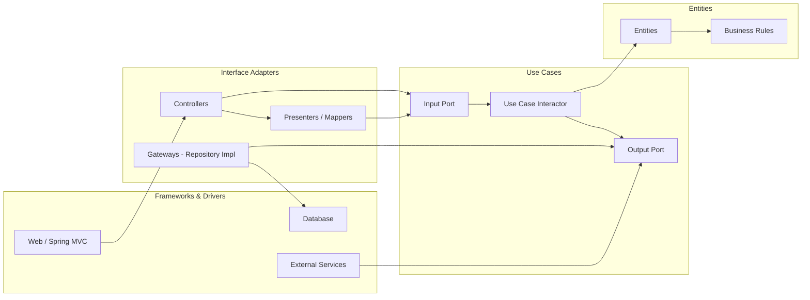

# Unified Eats – Fase 2

Projeto do Tech Challenge (Fase 2) com foco em **Clean Architecture**, boas práticas e separação clara entre regras de negócio e detalhes técnicos.

---

## Objetivo

Construir uma API backend organizada, evolutiva e desacoplada de frameworks, facilitando testes, manutenção e crescimento do domínio ao longo do projeto.

---

## Arquitetura

A arquitetura segue os princípios da **Clean Architecture**, conforme apresentada em aula, onde as dependências sempre apontam para as camadas mais internas.

### Clean Architecture (modelo conceitual)

---

### Regras de dependência

- **Entities (Domain)**  
  Contém as regras de negócio mais estáveis do sistema.  
  Não depende de frameworks, banco de dados ou APIs.

- **Use Cases (Application)**  
  Orquestram os fluxos do sistema e aplicam regras de negócio.  
  Dependem apenas do domínio e se comunicam com o mundo externo por meio de **ports (interfaces)**.

- **Interface Adapters**  
  Adaptam dados entre o formato externo (HTTP, DTOs, JSON) e o formato interno esperado pelos casos de uso.  
  Incluem controllers, mappers/presenters e gateways.

- **Frameworks & Drivers (Infrastructure)**  
  Contém detalhes técnicos como Spring, banco de dados e integrações externas.  
  Implementa interfaces definidas nas camadas internas.

---

### Regra fundamental

> Nenhuma camada interna pode depender de uma camada externa.

Em termos práticos:
- Controllers dependem de Use Cases
- Use Cases **não** dependem de Controllers
- Implementações concretas dependem de interfaces
- O domínio não conhece banco, framework ou API

---

### Organização prática do projeto

Embora o diagrama siga o modelo conceitual clássico da Clean Architecture, o projeto é organizado nas seguintes camadas:

- `domain`
- `application`
- `interface/api`
- `infrastructure`

Mantendo as mesmas regras de dependência e responsabilidades.

---

## Decisões arquiteturais (ADRs)

- [ADR 0001 — Adoção de Clean Architecture](docs/adr/0001-clean-architecture.md)
