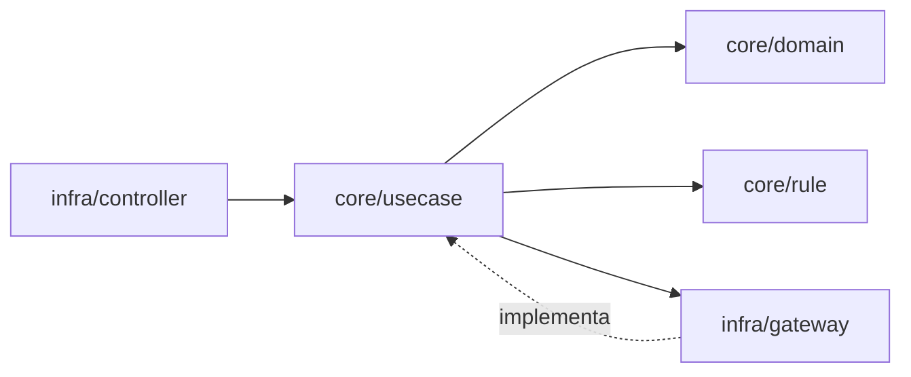

# Unified Eats – Tech Challenge Fase 2

Projeto desenvolvido como parte do **Tech Challenge – Fase 2 (FIAP)**, com foco em **Clean Architecture**, boas práticas de design, separação de responsabilidades e evolução do domínio de forma desacoplada de frameworks.

---

## Objetivo

Construir uma API backend organizada, evolutiva e testável, priorizando o isolamento das regras de negócio e a independência de detalhes técnicos como frameworks, banco de dados e camada web.

---

## Arquitetura

O projeto segue os princípios da **Clean Architecture**, onde as dependências sempre apontam para as camadas mais internas, mantendo o domínio protegido de detalhes externos.

---

## Diagrama de Dependências (Clean Architecture)

---

## Estrutura de Pacotes – Clean Architecture

A organização do código é feita por **contexto de negócio**, e dentro de cada contexto a separação segue o modelo **core / infra**.

### Visão geral da estrutura

<contexto>
 ├── core
 │   ├── domain
 │   ├── rule
 │   ├── exception
 │   └── usecase
 └── infra
     ├── controller
     └── gateway

Exemplos de contextos no projeto:
- cardapio
- restaurante
- usuario

---

## Responsabilidade de cada pacote

core/domain  
Contém as entidades do domínio e objetos de valor.  
É a camada mais interna e não depende de frameworks, banco de dados ou camada web.

core/rule  
Agrupa regras de negócio e validações reutilizáveis do domínio.  
Permanece isolado de infraestrutura e frameworks.

core/exception  
Exceções relacionadas às regras de negócio e da aplicação, sem acoplamento a HTTP ou camada web.

core/usecase  
Camada de casos de uso (Application Layer).  
Responsável por orquestrar o fluxo da aplicação, aplicando regras do domínio e delegando interações externas por meio de abstrações.

infra/controller  
Camada de entrada da aplicação (ex: REST Controllers).  
Responsável apenas por receber requisições, validar dados de entrada e acionar os casos de uso.

infra/gateway  
Camada de infraestrutura, responsável por persistência, integrações externas ou comunicação com outros sistemas.  
Implementa dependências utilizadas pelos casos de uso.

---

## Regras de dependência

- O pacote core não depende de infra
- O domínio não conhece frameworks
- Controllers não contêm regra de negócio
- Casos de uso centralizam a lógica da aplicação
- Implementações concretas dependem de abstrações definidas no core

Essa organização garante baixo acoplamento, alta coesão e facilita testes, manutenção e evolução do sistema.

---

## Decisões arquiteturais (ADRs)

As principais decisões arquiteturais do projeto são documentadas utilizando **Architectural Decision Records (ADR)**.

- ADR 0001 — Adoção de Clean Architecture
